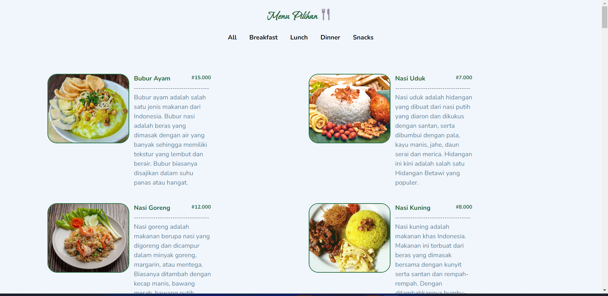

<div id="top"></div>
<div align="center">
    <h1  align="center" >Rumah Makan menggunakan React.js</h1>
    
</div>
<!-- TABLE OF CONTENTS -->
<details>
  <summary>Table of Contents</summary>
  <ol>
    <li>
      <a href="#about-the-project">About The Project</a>
        <ul>
            <li><a href="#overview">Overview</a></li>
            <li><a href="#built-with">Built With</a></li>
            <li><a href="#getting-started">Getting Started</a></li>
            <li><a href="#available-script">Available Script</a></li>
            <li><a href="#dependencies">Dependencies</a></li>
        </ul>
    </li>      
  </ol>
</details>


## About The Project
It provides an overview of how to create a menu list using React.js.

**Features**
```
A categorize navigation to see the menu list based on the category.
```

## Overview

* [Repo Codes](https://github.com/Omniamutanturnihilinterit/MenuMakanan)

* [Hosted Link](https://rumah-makan-bu-haji-sumarni.vercel.app/)

<p align="right">(<a href="#top">back to top</a>)</p>

### Built With

* [React](https://reactjs.org/)

* [Tailwind css](https://tailwindcss.com/)

* [vite](https://vitejs.dev/guide/#scaffolding-your-first-vite-project)


<p align="right">(<a href="#top">back to top</a>)</p>

## Getting Started
To get a local copy up and running follow these simple example steps:

## Available Script

In the project directory, you can run:

 ### `npm run dev`

Runs the app in the development mode.


<p align="right">(<a href="#top">back to top</a>)</p>

### Dependencies
[npm react-router-dom@6](https://reactrouter.com/docs/en/v6/getting-started/installation)

[react-loader-spinner ](https://www.npmjs.com/package/react-loader-spinner)

<p align="right">(<a href="#top">back to top</a>)</p>

